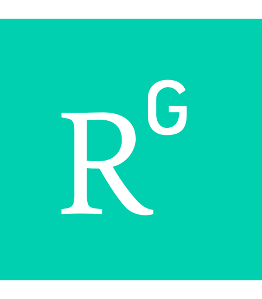

---

```{r setup, include=FALSE}
knitr::opts_chunk$set(echo = FALSE)
pkgs <- c("tidyverse", "knitr", "kableExtra", "glue", "psych", 
          "scales", "tibble", 'reactable')
xfun::pkg_attach(pkgs, install = T, message = F)
```

*Updated on July 5, 2023*

<link href="site_libs/font-awesome-5.1.0/css/all.css" rel="stylesheet" />
<link href="site_libs/font-awesome-5.1.0/css/v4-shims.css" rel="stylesheet" />

<br><br>

<a href="https://orcid.org/0000-0002-8280-3370" target="blank">

</a>&nbsp;&nbsp;&nbsp;&nbsp;<a href="https://scholar.google.com/citations?user=-d4Jj1UAAAAJ&hl=en" target="blank">

</a>&nbsp;&nbsp;&nbsp;&nbsp;<a href="https://www.researchgate.net/profile/Ekarin_Pongpipat" target="blank">

</a>&nbsp;&nbsp;&nbsp;&nbsp;<a href="https://www.webofscience.com/wos/author/record/AEU-4061-2022" target="blank">

</a>&nbsp;&nbsp;&nbsp;&nbsp;<a href="https://www.linkedin.com/in/epongpipat/" target="blank">

</a>

<br><br>

## Education

---

<div class="divTable">
<div class="divTableBody">

<div class="divTableRow">
<div class="divTableCellLogo">

</div>
<div class="divTableCellInfo"> 
<B>Ph.D. Student, Cognition and Neuroscience</B> (2017 - Present)
<BR> The University of Texas at Dallas
<BR> Advisors: Dr. Karen M. Rodrigue & Dr. Kristen M. Kennedy
</div>
</div>

<div class="divTableRow">
<div class="divTableCellLogo">

</div>
<div class="divTableCellInfo"> 
<B>M.A., Psychology</B> (2016)
<BR> San Diego State University
<BR> Advisor: Dr. Claire Murphy
<BR> Thesis: Altered Functional Connectivity and Eating Disinhibition in Individuals with Metabolic Syndrome
</div>
</div>

<div class="divTableRow">
<div class="divTableCellLogo">

</div>
<div class="divTableCellInfo"> 
<B>B.A., Psychology</B> (2012)
<BR> California State University, Northridge
<BR> Advisor: Dr. Jose P. Abara
</div>
</div>

</div>
</div>

<br><br>

## Research Experience

---

<div class="divTable">
<div class="divTableBody">

<div class="divTableRow">
<div class="divTableCellLogo">

</div>
<div class="divTableCellInfo"> 
<B>Graduate Research Assistant</B> (2017 - Present)
<BR>Cognitive Neuroscience of Aging Laboratory
<BR>Center for Vital Longevity
<BR>School of Behavioral and Brain Sciences
<BR>The University of Texas at Dallas
</div>
</div>

<div class="divTableRow">
<div class="divTableCellLogo">

</div>
<div class="divTableCellInfo"> 
<B>Graduate Research Assistant</B> (2014 - 2016)
<BR>Lifespan Human Senses Laboratory
<BR>Department of Psychology
<BR>San Diego State University
</div>
</div>

<div class="divTableRow">
<div class="divTableCellLogo">

</div>
<div class="divTableCellInfo"> 
<B>Undergraduate Research Assistant</B> (2011 - 2013)
<BR>Neuroscience Laboratory
<BR>Department of Psychology
<BR>California State University, Northridge
</div>
</div>

</div>
</div>

<BR><BR>

## Teaching Experience

---

<div class="divTable">
<div class="divTableBody">

<div class="divTableRow">
<div class="divTableCellLogo">

</div>
<div class="divTableCellInfo"> 
<B>Graduate Teaching Assistant</B> (2017 - 2019)
<BR>The University of Texas at Dallas
<BR>1. Statistics for Psychology, ACN6312/HCS6312 (Spring 2019)
<BR><div class="divIndent">Under the supervision of Dr. Nancy Juhn</div>
<BR>2. Statistics for Psychology, PSY2317 (Fall 2017, Spring 2018, Fall 2018)
<BR><div class="divIndent">Under the supervision of Dr. Nancy Juhn</div>
</div>
</div>

<div class="divTableRow">
<div class="divTableCellLogo">

</div>
<div class="divTableCellInfo"> 
<B>Graduate Teaching Assistant</B> (2014 - 2016)
<BR>San Diego State University
<BR>1. Advanced Statistics in Psychology, PSY670A/B (Fall 2015, Spring 2016)
<BR><div class="divIndent">Under the supervision of Dr. Melody Sadler</div>
<BR>2. Statistical Methods in Psychology Laboratory, PSY280L (Fall 2014, Spring 2015)
<BR><div class="divIndent">Under the supervision of Dr. Melody Sadler, Dr. Amy Spilkin, and Dr. Dale Glaser</div>
</div>
</div>

</div>
</div>

<BR><BR>

## Publications

---

```{r publications, warning = F, message = F}
pubs <- read_csv("publications.csv")
```

```{r}
pubs2html <- function(data) {
  
  data <- data %>%
    arrange(desc(status), desc(year), desc(month))
  
  html_code <- ""
  for (i in 1:nrow(data)) {
    
    reference <- '<div class="divReferences">'
    authors <- str_replace(data$authors[i], "Pongpipat, E. E.", "**Pongpipat, E. E.**")
    reference <- glue("{reference}{authors}")
    
    if (tolower(data$status[i]) == "accepted") {
      reference <- glue("{reference} ({data$year[i]}).")
    } else if (tolower(data$status[i]) == "in press") {
      reference <- glue("{reference} ({data$year[i]}, *{data$status[i]}*).")
    } else {
      reference <- glue("{reference} (*{data$status[i]}*).")
    }
  
    reference <- glue("{reference} {data$title[i]}.")
    
    if (!is.na(data$journal[i]) & !is.na(data$volume[i])) {
      reference <- glue("{reference} *{data$journal[i]}, {data$volume[i]}*")
    } else if (!is.na(data$journal[i]) & is.na(data$volume[i])) {
      reference <- glue("{reference} *{data$journal[i]}*")
    }
    
    if (!is.na(data$issue[i])) {
      reference <- glue("{reference}({data$issue[i]})")
    } 
      
    if (!is.na(data$pages[i])) {
      reference <- glue("{reference}, {data$pages[i]}")
    } 
    reference <- glue("{reference}.")
      
    if (!is.na(data$doi[i])) {
      reference <- glue("{reference} <a href='https://doi.org/{data$doi[i]}' target='_blank'>https://doi.org/{data$doi[i]}</a>.")
    }
    
    if (!is.na(data$note[i])) {
      reference <- glue("{reference} ({data$note[i]}).")
    }
    
    if (!is.na(data$pdf[i])) {
      reference <- glue("{reference} &nbsp;&nbsp;&nbsp;&nbsp;&nbsp;&nbsp;&nbsp;&nbsp;&nbsp;<a href='{data$pdf[i]}' target='_blank'><i class='fas fa-file-pdf'></i></a>")
    }
    
    reference <- glue("{reference}</div>") 
    
    if (i > 1) {
      html_code <- glue("{html_code}<br>{reference}")
    } else {
      html_code <- reference 
    }
  }
  
  return(html_code)
}
```


`r pubs2html(pubs)`


<BR><BR>

## Poster Presentations

---

<div class="divReferences">
```{r posters, warning = F, message = F, fig.width = 5, fig.height = 2, fig.asp = T, dev='svg'}
posters <- read_csv("posters.csv")

posters$Authors <- gsub("Pongpipat, E. E.", "<b>Pongpipat, E. E.</b>", posters$Authors)

posters <- posters %>%
  arrange(desc(Year), desc(Month), Authors) %>%
  rowwise() %>%
  mutate(Date = ifelse(Status != "Complete", paste(Year, Month, tolower(Status), sep = ", "), paste(Year, Month, sep = ", ")))

posters <- posters %>%
  mutate(html = paste0(Authors, " (", Date, "). <i>", Title, "</i>. Poster session presented at the ", Conference, ", ", Location, ifelse(is.na(Note), "", paste0(". (", Note, ")."))))

posters_html <- paste(posters$html, collapse = "\n\n")

poster_summary <- posters %>%
  select(Year) %>%
  group_by(Year) %>%
  summarize(Frequency = n())

poster_summary <- rbind(poster_summary, c(2017, 0))

poster_summary <- poster_summary %>%
  arrange(Year)

poster_mean_per_year <- round(describe(poster_summary$Frequency)[["mean"]], 2)
poster_se_per_year <- round(describe(poster_summary$Frequency)[["se"]], 2)
poster_total <- sum(poster_summary$Frequency)

df_poster <- data.frame(Year = min(poster_summary$Year):max(poster_summary$Year)) %>%
  left_join(poster_summary) %>%
  mutate(Frequency = ifelse(is.na(Frequency), 0, Frequency),
         Year = as.Date(paste0(Year,"-01-01"), "%Y-%m-%d"))

hex_color <- "#106a8c"
ggplot(df_poster, aes(x = Year, y = Frequency)) +
  geom_line(color = hex_color) +
  geom_point(color = hex_color) +
  theme_classic() +
  scale_x_date(labels = date_format("%Y"), date_breaks= "1 year") +
  labs(subtitle = paste0("Total: ", poster_total, ", Mean Per Year: ",poster_mean_per_year," ± ",poster_se_per_year),
       x = "Year") +
  theme(
    axis.text.x = element_text(angle = 45, hjust = 1)
  )
```

`r posters_html`

</div>

<BR><BR>

## Talks and Workshops

---

```{r talks, results = 'asis'}
talks <- tribble(~Date, ~Description, ~Institution, ~Links,
                 "2022-10", "Multi-Level Modeling Lab Workshop", "Center for Vital Longevity<br>UT Dallas", "<a href='https://github.com/epongpipat/workshop-mlm' target='blank'><i class='fab fa-github'></i></a> &#8201 <a href='https://ekarinpongpipat.com/workshop-mlm' target='_blank'><i class='fas fa-link'></i></a>", 
                 "2019-11", "Brianhack Dallas 2019", "UT Dallas", "<a href='https://github.com/Brainhack-Dallas/mini-brainhack-utd' target='blank'><i class='fab fa-github'></i></a> &#8201 <a href='https://brainhack-dallas.github.io/mini-brainhack-utd/' target='_blank'><i class='fas fa-link'></i></a>",
                 "2019-10", "Talk on 'Functional connectivity of the fronto-parietal and default mode networks during the n-back across the adult lifespan' given at the Developmental, Cognitive and Social/Personality Brownbag Series", "UT Dallas", "",
                 "2019-09", "Assisted in an introduction to Git/GitHub Workshop with Dr. Micaela Chan", "Center for Vital Longevity<br>UT Dallas", "<a href='https://github.com/mychan24/git_github_workshop' target='_blank'><i class='fab fa-github'></i></a> &#8201 <a href='https://gitbookdown.dallasdatascience.com/' target='_blank'><i class='fas fa-book'></i></a>",
                 "2019-04", "Guest lectured on using R for descriptive and inferential statistics for Dr. Juhn's Research Methods 2 Course", "UT Dallas", "")

kable(talks, escape = F) %>%
  kable_styling(bootstrap_options = c("striped", "hover", "condensed", "responsive")) %>%
  column_spec(1, width = "10%") %>%
  column_spec(2, width = "60%")
```

<BR><BR>

## Service to the Profession

---

- Reviewer for Psychophysiology
- Co-reviewer for NeuroImage with Dr. Kristen Kennedy
- Co-reviewer for Journal of Cognitive Neuroscience with Dr. Kristen Kennedy
- Co-reviewer for Cerebral Cortex with Dr. Karen Rodrigue
- Co-reviewer for Journal of Neuroscience with Dr. Karen Rodrigue

<BR><BR>

## Honors and Awards

---

```{r honors_awards}
df_honors_awards <- read.csv("honors-and-awards.csv")

# total <- sum(df_honors_awards$Award, na.rm = TRUE)


total <- c(Year = 'Total', Institution = '', Honor = '', Award = glue(" ${sum(df_honors_awards$Award, na.rm = TRUE)}"))

df_honors_awards <- df_honors_awards %>%
  mutate(Award = ifelse(is.na(Award), '', glue("${Award}"))) %>%
  rbind(total)

df_honors_awards %>%
  kable(., "html") %>%
  kable_styling(bootstrap_options = c("striped", "hover", "responsive")) %>%
  column_spec(1, width = "150px")

# reactable(df_honors_awards, 
#           sortable = FALSE,
#           striped = TRUE, 
#           highlight = TRUE, 
#           pagination = FALSE, 
#           columns = list(
#             Year = colDef(footer = "Total", width = 125),
#             Award = colDef(na = '-', 
#                            format = colFormat(prefix = '$'), 
#                            footer = function(values) sprintf("$%.0f", sum(values, na.rm = TRUE)),
#                            width = 75)
#           ),
#           defaultColDef = colDef(footerStyle = list(fontWeight = "bold"))
# )
```

<BR><BR>

## Professional Society Membership

---

```{r professional_society_membership}
professional_society_membership <- tribble(~Year, ~Institution,
                                           "2020 - Present", "Organization for Human Brain Mapping",
                                           "2020 - Present", "Cognitive Neuroscience Society",
                                           "2012 - Present", "Society for Neuroscience",
                                           "2016 - 2017", "Phi Kappa Phi Honor Society",
                                           "2015 - 2017", "The Obesity Society",
                                           "2012 - 2016", "Western Psychological Association")
# Prints table
kable(professional_society_membership, "html") %>%
  kable_styling(bootstrap_options = c("striped", "hover", "responsive")) %>%
  column_spec(1, width = "150px")
```